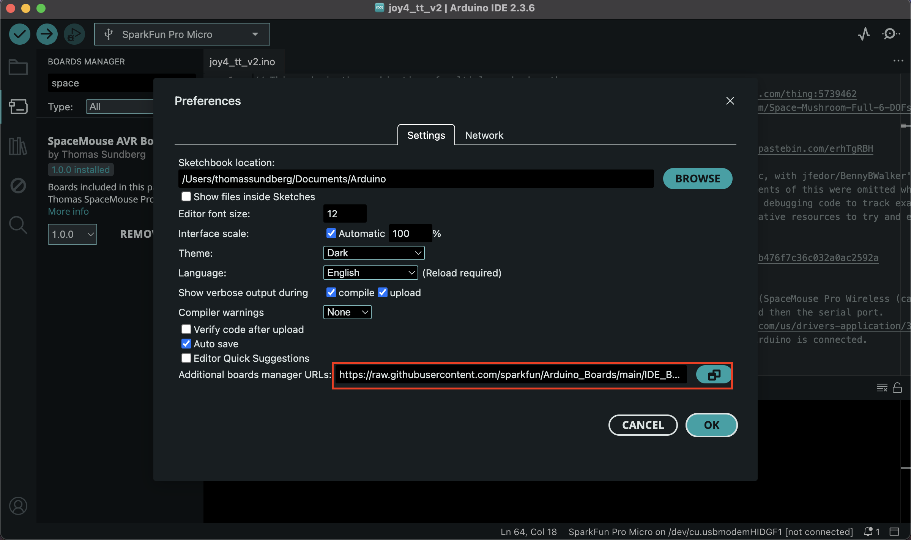

# SparkFun Arduino Pro Micro Board (5v,16MHz) with updated values for compatibility with 3dconnections software

This repository contains support for the following SparkFun Arduino-compatible development boards that have been modified to be recognized by the 3dconnections software.

**IMPORTANT NOTE:** These board files have been updated for compatibility with Arduino version 1.8 and higher. Some boards may not compile correctly with earlier versions of Arduino. If you need compatibility with earlier versions of Arduino, you can choose previous releases of these boards from the Boards Manager.

- [Pro Micro 5V ](https://a.co/d/3ddU77Y)
- [Joysticks](https://a.co/d/2xWhi8S)

### Installation Instructions

To add board support for our products, start Arduino and open the Preferences window (**File** > **Preferences**). Now copy and paste the following URL into the 'Additional Boards Manager URLs' input field:

    https://raw.githubusercontent.com/twprintsstudio/SpaceMouse/main/IDE_Board_Manager/package_thomas_spacemouse_index.json

If you type "spacemouse" (without quotes) into the "filter your search" field, you will see options to install SpaceMouse AVR Boards files. Click in the desired box, and click the "Install" button that appears. Once installed, the boards will appear at the bottom of the board list.

If you go to "tools" then go to "Boards" and find "SpaceMouse AVR Boards" and then select "Thomas SpaceMouse Pro Micro"

